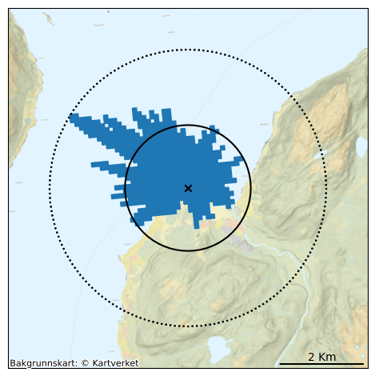

# Tools for working with shape-files exported by ARGOS   
Functionallity:
* Create Excel file based on max values found in Shape files. See `create_table.py --help` 
* Parse all shape files to dataframes and dump as "pickle". See `batch_all.bat` and `parse_all_runs.py`
* Plot dataframes in maps, based on Flagbook critera. Using generated dataframes from `parse_all_runs.py`. `See plot_summary.py` 
* Plot single run with coloring the areas based on critera, see `plot_isovalues.py` 

## Output examples
### Cells where critera for sheltering is exceeded, based on 500 runs:  

 
### Single run with I-131 depsitions plotted:  

# Trace
PATH="$PATH:/home/einar/.cargo/bin"; functiontrace create_columns.p